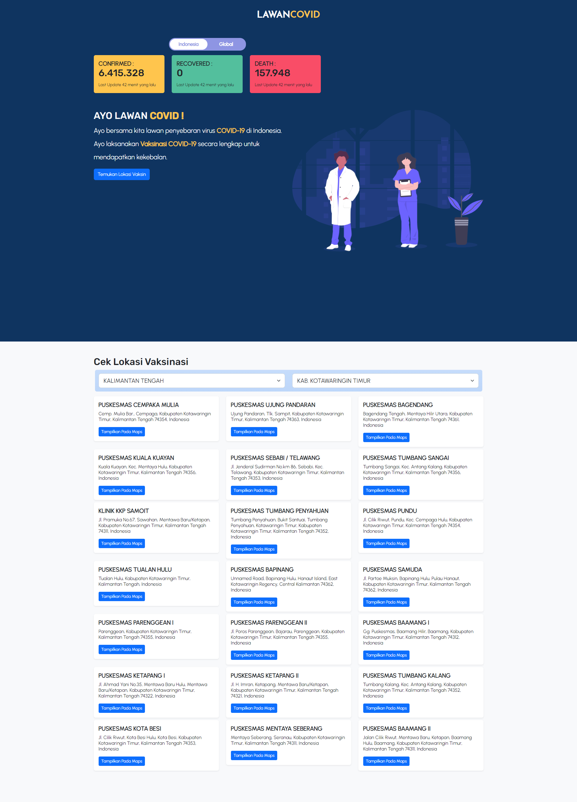
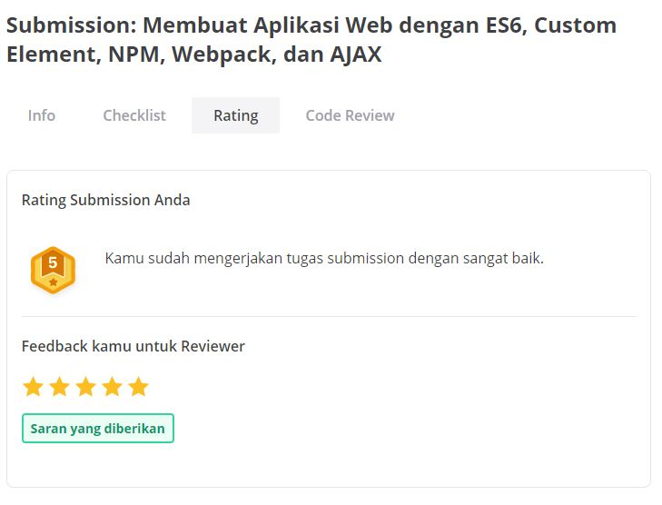
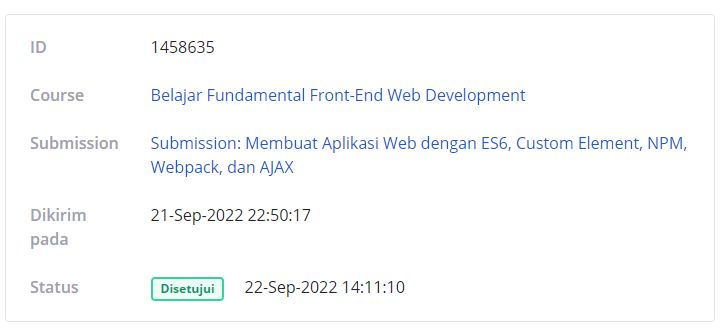

# Lawan-Covid-Submission-Fundamental-Font-End-Web-Development
Hanya untuk Referensi untuk Dicoding Submission Belajar Fundamental Front-End Web Development
## Screenshoot
### Result

### Submission Info

## Resources
1. [Belajar Fundamental Front-End Web Development](https://www.dicoding.com/academies/163).
2. [Covid-19 API](https://github.com/mathdroid/covid-19-api).
3. [Covid-19 API Indonesia](https://covid19.go.id/dokumentasi-api).
4. Illustration by [Undraw](https://undraw.co/) on Undraw
